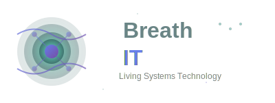

<div align="center">
  
</div>

# Agent Framework Platform

<!-- 
🔧 SETUP REQUIRED: This README contains placeholders that need customization:
- Update badges with your actual repository URLs and package names
- Replace YOUR-USERNAME/YOUR-REPO-NAME with your GitHub details
- Add your actual support links (Discord, email, etc.)
- Customize the roadmap and features to match your implementation
-->

[](https://opensource.org/licenses/MIT)
[](#)
[](./docs/)
[](#)

A comprehensive, production-ready framework for building intelligent agents with built-in monitoring, security, and scalability features.

## 🏗️ Architecture Overview

This repository contains two distinct but related components:

### 🔧 **Base Framework** (`/src/core/`)
The foundational platform that provides:
- **Agent Lifecycle Management** - Creation, initialization, and cleanup
- **Event-Driven Architecture** - Message queues, webhooks, real-time communication
- **Security Layer** - Authentication, authorization, data protection
- **Monitoring & Health Checks** - Performance tracking, error handling, alerting
- **Database Integration** - Multi-database support with migration tools
- **API Gateway** - REST/GraphQL endpoints with rate limiting
- **DevOps Ready** - Docker, Kubernetes, CI/CD pipelines

### 🤖 **Example Agents** (`/examples/`)
Ready-to-use agent implementations showcasing the framework's capabilities:
- **Budget Management Agent** - Financial planning, expense tracking, budget optimization
- **Health Monitoring Agent** - Wellness tracking, goal setting, progress analytics
- **Task Automation Agent** - Workflow automation, scheduling, notifications
- **Data Analysis Agent** - Report generation, trend analysis, insights

---

## 🚀 Quick Start

### Prerequisites
- Node.js 18+ or Python 3.9+
- Docker & Docker Compose
- PostgreSQL 13+ (or use Docker setup)

### Installation

```bash
# Clone the repository
git clone https://github.com/YOUR-USERNAME/YOUR-REPO-NAME.git
cd YOUR-REPO-NAME

# Install dependencies
npm install
# OR
pip install -r requirements.txt

# Set up environment
cp .env.example .env
# Edit .env with your configuration

# Start the base framework
docker-compose up -d
npm run start
```

### Running Your First Agent

```bash
# Start the Budget Management example agent
npm run agent:budget-management

# Or use the CLI
./bin/agent-cli start --type=budget-management --config=examples/budget-management/config.json
```

---

## 📋 Base Framework vs Example Agents

| Aspect | **Base Framework** | **Example Agents** |
|--------|-------------------|-------------------|
| **Purpose** | Core infrastructure and APIs | Functional demonstrations |
| **Location** | `/src/core/`, `/src/api/`, `/src/infrastructure/` | `/examples/` |
| **Modification** | Extend, don't modify directly | Customize freely |
| **Dependencies** | Production-grade, stable | Educational, demonstrative |
| **Testing** | Comprehensive unit/integration tests | Basic functionality tests |
| **Documentation** | [95+ technical documents](./docs/) | Inline comments + README |
| **Deployment** | Production environments | Development/demo environments |

### 🔧 Base Framework Components

```
src/core/
├── agent-engine/          # Agent lifecycle management
├── communication/         # Message queues, webhooks, real-time
├── security/             # Authentication, authorization, encryption
├── monitoring/           # Health checks, metrics, alerting
├── database/             # Multi-DB support, migrations
├── api/                  # REST/GraphQL gateway
└── utils/                # Shared utilities, helpers

infrastructure/
├── docker/               # Container configurations
├── kubernetes/           # K8s manifests and Helm charts
├── terraform/            # Infrastructure as Code
└── ci-cd/                # GitHub Actions, GitLab CI
```

### 🤖 Example Agents Structure

```
examples/
├── budget-management/
│   ├── src/              # Agent implementation
│   ├── config/           # Configuration files
│   ├── tests/            # Unit tests
│   └── README.md         # Agent-specific guide
│
├── health-monitoring/
├── task-automation/
└── data-analysis/
```

---

## 📚 Documentation

We maintain **95+ comprehensive documents** organized across 13 categories:

### 🏗️ **Core Documentation**
- [**System Overview**](./docs/01-Core-System/System-Overview.md) - Start here for architecture understanding
- [**API Documentation**](./docs/02-API-Documentation/API-Overview.md) - Complete API reference
- [**Security Guide**](./docs/04-Security/Security-Overview.md) - Security architecture and compliance

### 👩‍💻 **Developer Guides**
- [**Development Setup**](./docs/13-Development/Development-Setup.md) - Local environment configuration
- [**Getting Started**](./docs/08-User-Guides/Getting-Started.md) - New user onboarding
- [**Coding Standards**](./docs/13-Development/Coding-Standards.md) - Style guides and best practices

### 🚀 **Operations**
- [**Deployment Guide**](./docs/05-DevOps/Deployment-Guide.md) - Production deployment procedures
- [**Monitoring & Alerting**](./docs/05-DevOps/Monitoring-Alerting.md) - System observability
- [**Troubleshooting**](./docs/10-Troubleshooting/Common-Issues.md) - Common issues and solutions

[**📖 Complete Documentation Index**](./docs/Complete-Documentation-Structure.md)

---

## 🛠️ Usage Examples

### Creating a Custom Agent

```javascript
// Using the base framework
import { BaseAgent, AgentConfig } from '@agent-framework/core';

class MyCustomAgent extends BaseAgent {
  constructor(config) {
    super(config);
    this.initialize();
  }

  async processMessage(message) {
    // Your agent logic here
    const response = await this.handleUserInput(message);
    return this.formatResponse(response);
  }
}

// Register and start
const agent = new MyCustomAgent({
  name: 'my-custom-agent',
  capabilities: ['nlp', 'data-analysis'],
  endpoints: ['/api/v1/my-agent']
});

await agent.start();
```

### Using Example Agents

```javascript
// Budget Management Agent
import { EnhancedBudgetManagementAgent } from './examples/budget-management';

const budgetAgent = new EnhancedBudgetManagementAgent();

await budgetAgent.createBudgetPlan('user-123', {
  monthlyBudget: 3000,
  preferences: { fitness: 25, nutrition: 40, healthcare: 35 }
});

await budgetAgent.logExpense('user-123', 75, 'fitness', 'Gym membership');
const insights = await budgetAgent.generateInsights('user-123');
```

---

## 🧪 Testing

### Base Framework Tests
```bash
# Run comprehensive test suite
npm run test                    # All tests
npm run test:unit              # Unit tests only
npm run test:integration       # Integration tests
npm run test:e2e              # End-to-end tests
npm run test:coverage         # Coverage report
```

### Example Agent Tests
```bash
# Test specific example agents
npm run test:examples                          # All example agents
npm run test:examples:budget-management        # Budget agent only
npm run test:examples:health-monitoring        # Health agent only
```

---

## 🚀 Deployment

### Development Environment
```bash
# Quick local setup
docker-compose -f docker-compose.dev.yml up -d
npm run dev
```

### Production Environment
```bash
# Kubernetes deployment
kubectl apply -f infrastructure/kubernetes/
helm install agent-framework ./infrastructure/helm/

# Or Docker Swarm
docker stack deploy -c docker-compose.prod.yml agent-framework
```

### Environment Configuration
- **Development**: `.env.development`
- **Staging**: `.env.staging`  
- **Production**: `.env.production`

See [Deployment Guide](./docs/05-DevOps/Deployment-Guide.md) for detailed instructions.

---

## 📊 Monitoring & Health

The framework includes built-in monitoring and health check capabilities:

- **Health Endpoint**: `GET /health` - System status
- **Metrics**: Prometheus integration for monitoring
- **Alerting**: Configurable alerts for system events
- **Logging**: Centralized logging with ELK stack

Monitor your agents at: `http://localhost:3000/dashboard`

---

## 🤝 Contributing

We welcome contributions to both the base framework and example agents!

### Contributing to Base Framework
1. Fork the repository
2. Create a feature branch: `git checkout -b feature/your-feature`
3. Follow our [coding standards](./docs/13-Development/Coding-Standards.md)
4. Add comprehensive tests
5. Submit a pull request

### Contributing Example Agents
1. Create your agent in `/examples/your-agent-name/`
2. Include comprehensive README and tests
3. Follow the example agent structure
4. Demonstrate unique framework capabilities

See [Code Review Process](./docs/13-Development/Code-Review-Process.md) for detailed guidelines.

---

## 📄 License

This project is licensed under the MIT License - see the [LICENSE](LICENSE) file for details.

---

## 🆘 Support & Community

- **Documentation**: [Complete docs directory](./docs/)
- **Issues**: [GitHub Issues](../../issues) (relative link to your repo's issues)
- **Discussions**: [GitHub Discussions](../../discussions) (relative link to your repo's discussions)
- **Discord**: [Join our community](#) <!-- Replace with your Discord invite -->
- **Email**: [Contact Support](#) <!-- Replace with your support email -->

---

## 🗺️ Roadmap

### Current Release (v2.1)
- ✅ Enhanced security with OAuth2/JWT
- ✅ Multi-database support
- ✅ Comprehensive monitoring
- ✅ Example agents library

### Upcoming (v2.2)
- 🔄 GraphQL API enhancement
- 🔄 Real-time agent communication
- 🔄 Advanced ML integration
- 🔄 Multi-tenant architecture

### Future (v3.0)
- 🔮 Agent marketplace
- 🔮 No-code agent builder
- 🔮 Distributed agent networks
- 🔮 Advanced AI capabilities

---

**⭐ Star this repository if you find it helpful!**

**🚀 Ready to build intelligent agents? [Get started now](./docs/08-User-Guides/Getting-Started.md)**


